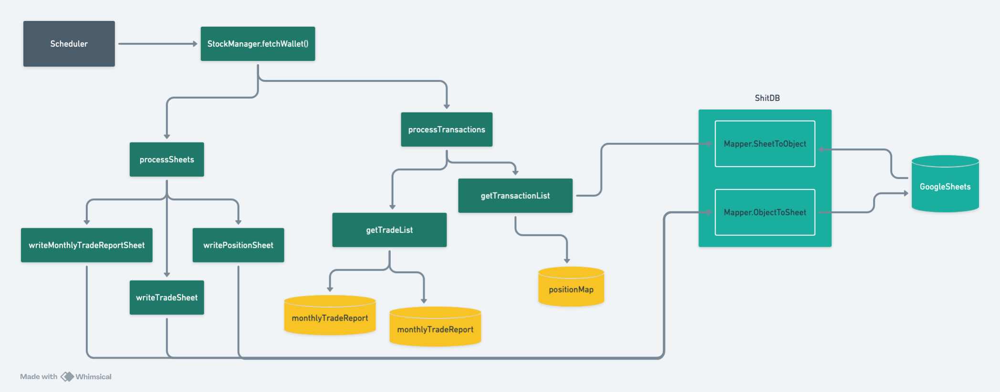

# Stock Manager

Google Apps Script for managing stocks at Google Sheets.

## System design

## Summary

The Stock Manager application reads data from the `transaction` sheet, which contains stock transaction details, and performs the following operations:

1. **Reads Transaction Data**: Reads through the `transaction` sheet, extracting the following elements:

    | Ticker | Side | Quantity | Total       | Price  |
    | ------ | ---- | -------- | ----------- | ------ |
    | SLCE3  | BUY  | 200      | $3,690.00   | $18.45 |
    | SLCE3  | BUY  | 150      | $2,767.50   | $18.45 |
    | VALE3  | SELL | 4000     | $265,408.50 | $66.35 |
    | PETR4  | BUY  | 500      | $7,325.00   | $14.65 |
    | ITUB4  | BUY  | 300      | $4,275.00   | $14.25 |
    | B3SA3  | SELL | 800      | $36,640.00  | $45.80 |

2. **Position Sheet**: Generates a sheet called `generatedPosition` containing aggregated stock position data. Each row in the `generatedPosition` sheet represents a unique stock position and contains the following elements:

    | Ticker | AvgPrice  | Qty  |
    | ------ | --------- | ---- |
    | VALE3  | 66.352125 | 4000 |
    | SLCE3  | 18.45     | 350  |
    | PETR4  | 25.70     | 800  |
    | ITUB4  | 30.20     | 600  |
    | BBDC4  | 28.90     | 700  |
    | B3SA3  | 45.80     | 450  |

3. **Trade Sheet**: Generates a sheet called `generatedTrade` containing trade information. Each row in the `generatedTrade` sheet represents a trade and contains the following elements:

    | Ticker | Quantity | AvgBuyPrice | SellPrice | Profit   | ProfitPercentage | Type  |
    | ------ | -------- | ----------- | --------- | -------- | ---------------- | ----- |
    | MGLU3  | 1        | R$ 62.02    | R$ 60.73  | -R$ 1.29 | -2.09%           | DAY   |
    | MGLU3  | 31       | R$ 59.62    | R$ 60.73  | R$ 34.41 | 1.86%            | SWING |
    | BTOW3  | 7        | R$ 85.00    | R$ 89.14  | R$ 29.00 | 4.87%            | SWING |
    | HGTX3  | 50       | R$ 15.72    | R$ 16.02  | R$ 14.90 | 1.90%            | SWING |
    | PSSA3  | 20       | R$ 51.68    | R$ 52.45  | R$ 15.36 | 1.49%            | SWING |
    | BKBR3  | 40       | R$ 13.60    | R$ 14.32  | R$ 28.90 | 5.31%            | SWING |

4. **Monthly Trade Report**: Generates a report called `monthlyTradeReport` containing monthly trade information. Each row in the `monthlyTradeReport` sheet represents a month and contains the following elements:

    | Year | Month | Total Sold   | Day Trade | Swing Trade  |
    | ---- | ----- | ------------ | --------- | ------------ |
    | 2023 | 01    | R$ 10,741.36 | R$ 60.73  | R$ 10,680.63 |
    | 2023 | 02    | R$ 7,269.62  | R$ 119.69 | R$ 7,149.93  |
    | 2023 | 03    | R$ 8,899.06  | R$ 0.00   | R$ 8,899.06  |
    | 2023 | 04    | R$ 9,170.60  | R$ 0.00   | R$ 9,170.60  |
    | 2023 | 05    | R$ 11,187.25 | R$ 0.00   | R$ 11,187.25 |
    | 2023 | 06    | R$ 438.20    | R$ 0.00   | R$ 438.20    |
